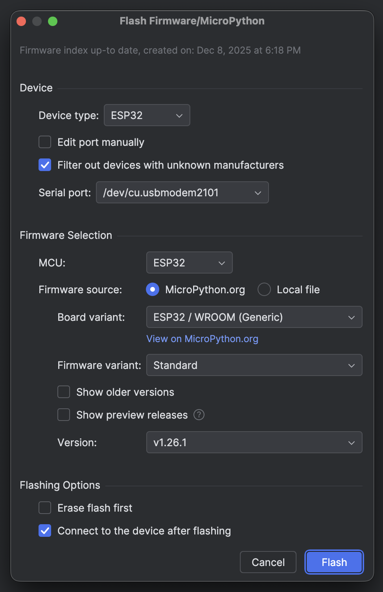
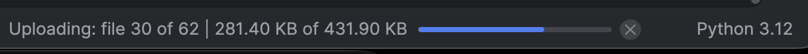
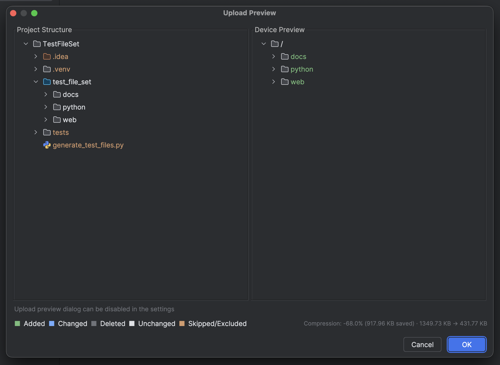
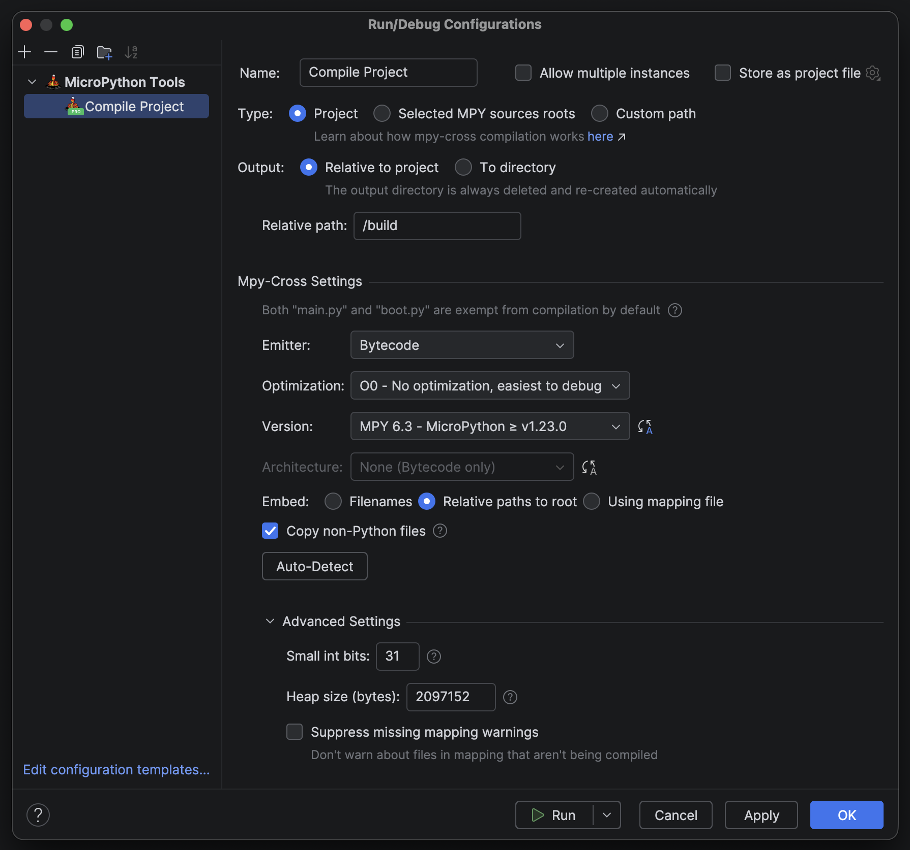
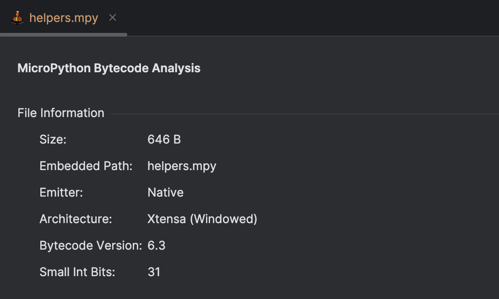

# MicroPython Tools Plugin for PyCharm, CLion, IntelliJ and other JetBrains IDEs

This plugin brings MicroPython support into JetBrains IDEs in Free and Pro editions.
It provides reliable device file system integration, REPL support, stub package management, firmware flashing, run
configurations and smooth workflows for developing both hobbyist and professional MicroPython projects.

The Free edition covers all essential MicroPython development needs, while the Pro edition adds advanced tools like
background transfers, compression, mpy-cross compilation, and bytecode analysis.

Usage tips, setup guide and documentation are available [here](DOCUMENTATION.md).

## Features

Forever Free features:

- Upload and synchronize files with MicroPython devices, automatically skipping already uploaded files (Serial and
  WebREPL supported)
- File System view with drag and drop, create/rename/delete, copy/cut/paste, and download
- Type Hint/Stub package manager for MicroPython stubs
- On-device file editing
- REPL integration with soft reset, hard reset, interrupt, and clear actions
- Automatically detect MicroPython device's serial port and connect
- Firmware flashing, automatically download MicroPython and flash ESP, RP2 and SAMD devices
- Execute files or code selections in REPL
- Run configurations for uploading and executing files in REPL
- Mounted volume support (e.g. SD cards)

Pro (Paid) features:

- Background uploads and downloads that let you continue working
- Automatic file compression to significantly speed up uploads
- mpy-cross run configuration with auto-detection of bytecode version and architecture
- .mpy file analyzer

#### Showcase video:

## Detailed Feature Readout

### Free Features

#### File System Widget

- Easily view and interact with the device's file system in a dedicated tool window
- Upload to or reorganize the file system via drag and drop
- Supports mounted volumes (such as SD cards) and displays storage usage for each mount point
- Create new files or directories directly on the device
- Full copy/cut/paste support (project to device and device to device)
- Download files from the device to your project
- Open and edit on-device files with save-to-device functionality

View File System Widget screenshot

View File System Context Menu screenshot

View File System Edit File screenshot

#### REPL Widget

- Full MicroPython REPL integration in a dedicated tool window
- All keyboard shortcuts are passed through to the device (Raw REPL, Paste mode, soft reset, interrupt)
- Toolbar actions for common operations (soft/hard reset, interrupt, clear)
- Optional auto-clear to prevent terminal clutter

View REPL Widget screenshot

#### Uploads and Synchronization

- Multiple upload methods: context menu actions, drag and drop, or run configurations
- Smart upload: already uploaded files are automatically skipped using CRC32 calculations
- Upload preview dialog shows exactly how the file system will look after the upload operation
- Synchronization mode to mirror your project structure on the device (removes extra files)

View Upload Preview screenshot

#### Firmware Flashing

- Flash MicroPython firmware directly from the IDE with real-time progress output
- Supports ESP, RP2 and SAMD devices
- Automatic firmware download from micropython.org or use local firmware files
- Configurable erase flash option (with universal flash nuke support for RP2 boards)
- Accessible through the plugin settings or file system widget when no device is connected

View Firmware Flashing Dialog screenshot

#### Run Configurations

Multiple run configuration types for different workflows:

- **Upload**: Select what gets uploaded (entire project, specific MicroPython Sources Roots, or custom paths)
    - Synchronize device file system to only contain uploaded files and folders
    - Exclude on-device paths from synchronization (e.g., logs, OTA directories, persistent config files)
    - Reset device and switch to REPL tab on success

View Upload Run Configuration screenshot

- **Execute in REPL**: Run `.py` or `.mpy` files directly in REPL without uploading to the device
    - Execute entire files or just selected code fragments
    - Perfect for testing without modifying the device file system

View Execute in REPL Run Configuration screenshot

View Execute Code Fragment screenshot

#### MicroPython Stubs Package Manager

- Built-in package manager for [Jos Verlinde's MicroPython stubs](https://github.com/Josverl/micropython-stubs)
- Install and apply stubs on-demand for your specific board and MicroPython version
- Automatic update notifications when newer stub versions are available
- Visual table showing installed, available, and selected packages

View Settings screenshot

#### Context Menu Actions

- Quick upload actions: upload to device root, relative to project, or relative to MicroPython Sources Root
- Execute file or code fragment in REPL directly from the editor
- Custom "Mark as MicroPython Sources Root" action for better IDE compatibility across JetBrains products

View File Context Menu Actions screenshot

View MicroPython Sources Root Action screenshot

### Pro Features

#### Background Uploads and Downloads

- Upload and download operations run in the background without blocking the IDE
- Continue coding while large file transfers are in progress
- Progress reporting in the IDE's background tasks manager

View Background Progress screenshot

#### Automatic File Compression

- Files are automatically compressed before upload to significantly speed up transfers
- Improves communication stability by reducing the amount of data transmitted
- Transparent compression/decompression on both sides

View Upload Preview with Compression screenshot

#### mpy-cross Run Configuration

- Compile Python files to MicroPython bytecode (`.mpy`) directly from the IDE
- Automatic detection of bytecode version and architecture for the connected board
- Supports custom compilation flags and options

View mpy-cross Run Configuration screenshot

#### .mpy File Analyzer

- View detailed information about compiled `.mpy` files
- Inspect bytecode version, architecture, and other metadata
- Helps troubleshoot compatibility issues

View .mpy File Analyzer screenshot

## Requirements

#### System Requirements

* A valid Python interpreter 3.10+
* Python Community plugin (for non-PyCharm IDEs)

#### MicroPython Device Requirements

* Official MicroPython firmware version 1.20.0 or newer from micropython.org/download
* Device must support standard MicroPython REPL features (REPL, Raw REPL and Raw Paste Mode)
* Some features require additional libraries (e.g., `binascii.crc32` for skipping already uploaded files). The plugin
  will warn if these are unavailable.

#### Compatibility Notice:

This plugin requires standard MicroPython REPL features (REPL, Raw REPL and Raw Paste Mode). Custom or
manufacturer-modified ports (such as micro:bit) that do not include these features are **not compatible** and will not
work and **no support** will be provided for such devices.

If you're using a custom port that preserves standard REPL functionality, the plugin should work. However, if you
encounter issues, please open an issue with firmware details - we'll investigate, but cannot guarantee support for
non-standard configurations.

MicroPython versions older than 1.20.0 are not officially supported but may work.

## License

This plugin is distributed via the JetBrains Marketplace or this repository's Releases and is licensed under the
[End-User License Agreement (EULA)](EULA.txt).

## Credits

Originally inspired by JetBrains’ MicroPython plugin, this project has since been fully reworked and expanded into a
standalone tool. Credit to [Jos Verlinde](https://github.com/Josverl/micropython-stubs) for creating and maintaining the
stubs used here, and to [Ilia Motornyi](https://github.com/elmot) and
[Andrey Vlasovskikh](https://github.com/vlasovskikh) for their work on the original plugin.

## Third-Party Notices

This plugin includes the following third-party components:

- **MicroPython Stubs** - Copyright 2020-2026 Jos Verlinde, MIT License  
  https://github.com/Josverl/micropython-stubs  
  See [licenses/stubs/LICENSE.md](licenses/stubs/LICENSE.md) for the full license.

- **Pico Universal Flash Nuke** - Copyright 2024 Phil Howard, BSD 3-Clause License  
  https://github.com/Gadgetoid/pico-universal-flash-nuke  
  See [licenses/rp2UniversalFlashNuke/LICENSE.txt](licenses/rp2UniversalFlashNuke/LICENSE.txt) for the full license.

- **Espflash** - Copyright (c) 2022-2025 The Espflash Project Developers  
  https://github.com/esp-rs/espflash  
  See [licenses/espflash/LICENSE.txt](licenses/espflash/LICENSE.txt) for the full license.

- **Java-WebSocket** - Copyright (c) 2010-2020 Nathan Rajlich, MIT License  
  https://github.com/TooTallNate/Java-WebSocket  
  See [licenses/java-WebSocket/LICENSE.txt](licenses/java-WebSocket/LICENSE.txt) for the full license.  