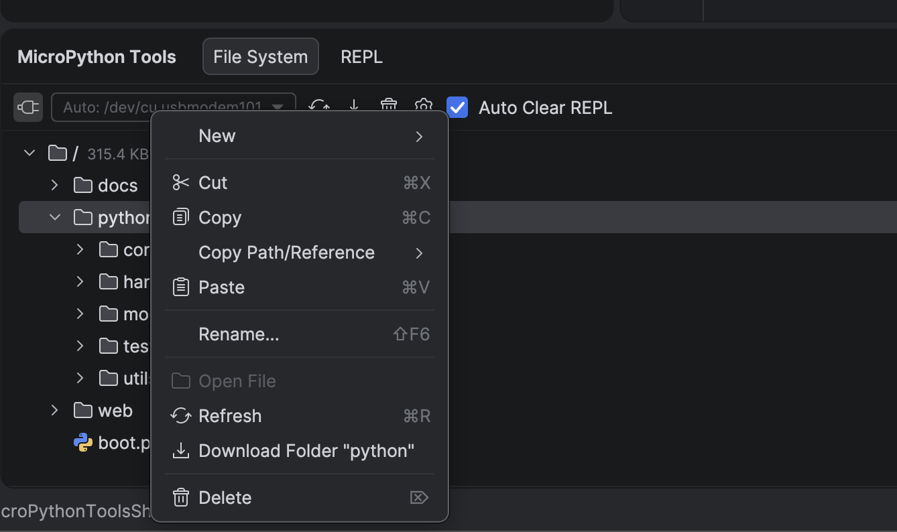
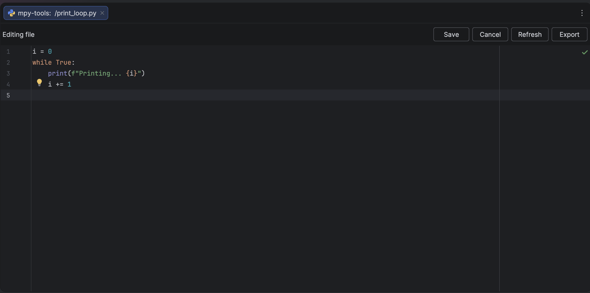
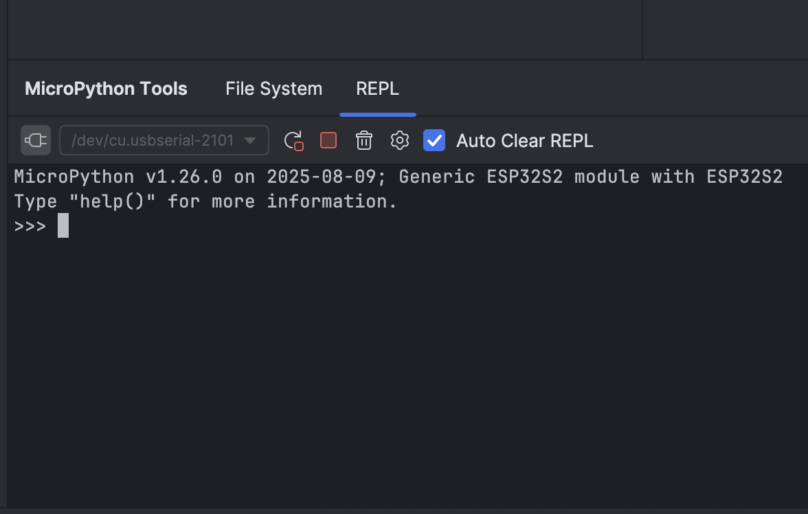
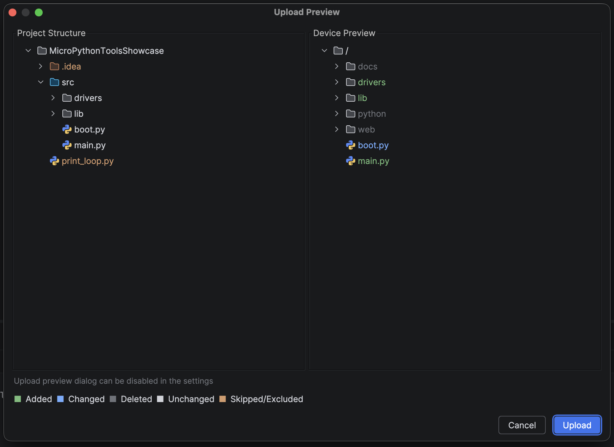
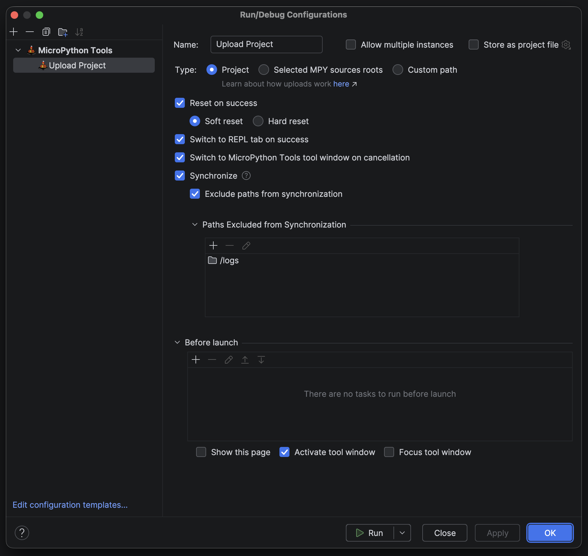
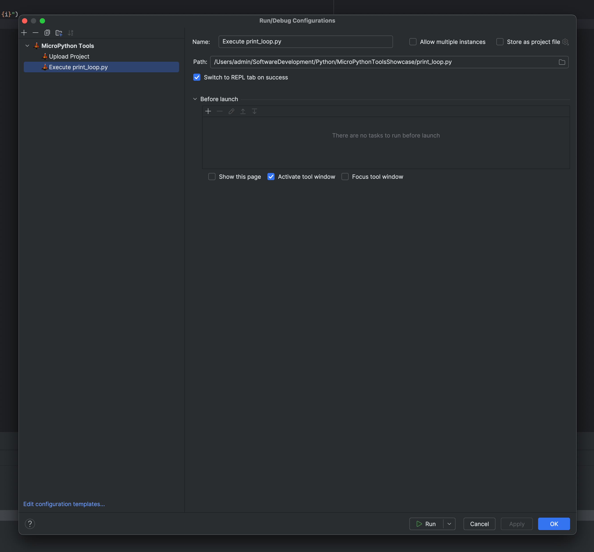
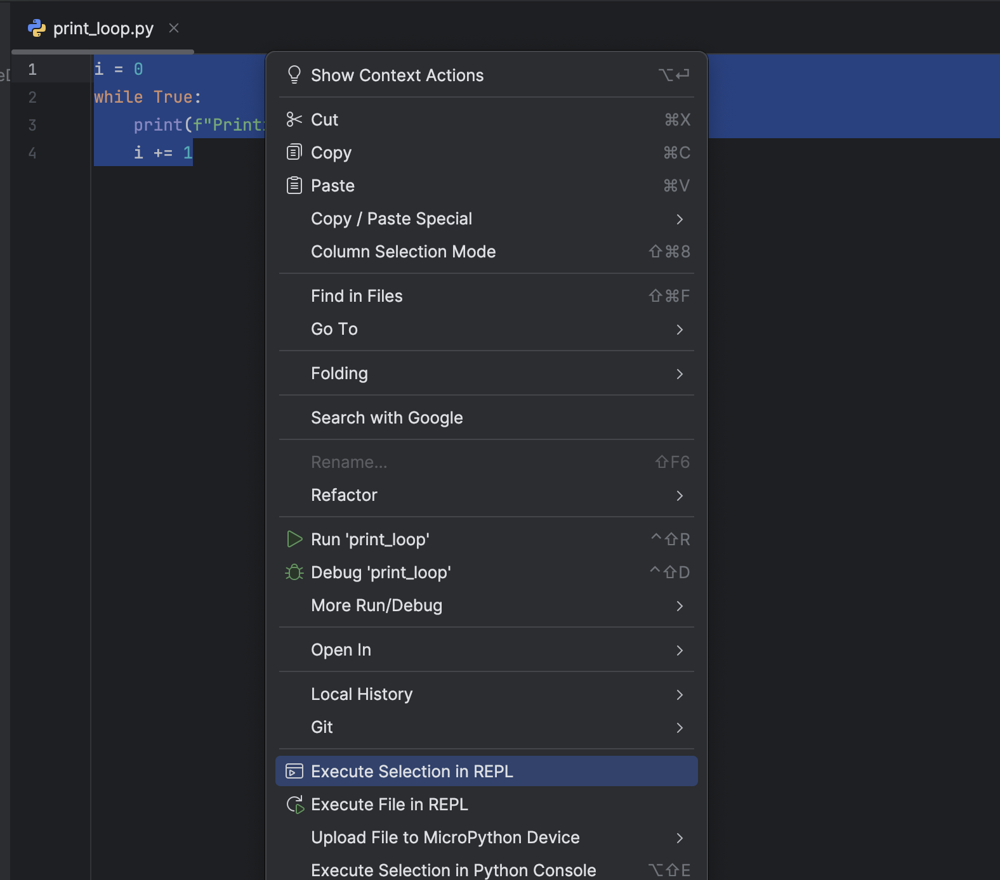
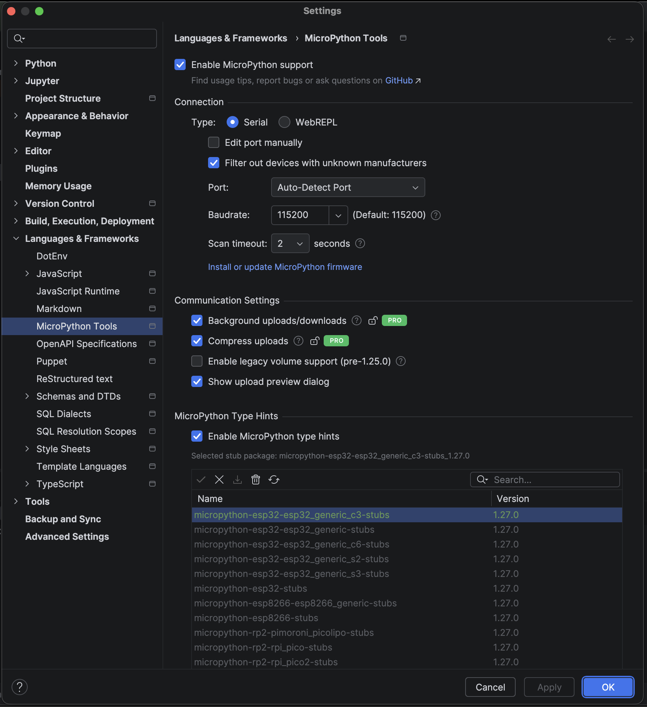
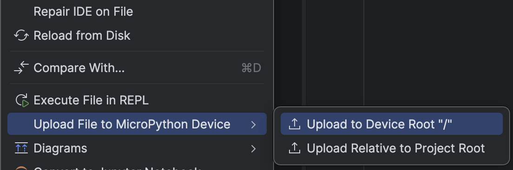
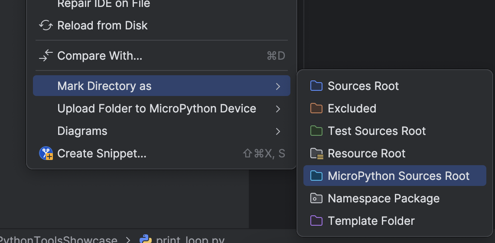

# MicroPython Tools Plugin for PyCharm, CLion, IntelliJ and other JetBrains IDEs

简体中文翻译版本：[请参阅此处](https://github.com/lukaskremla/micropython-tools-jetbrains/blob/main/README_zh-CN.md)

This plugin brings MicroPython support into JetBrains IDEs.
It provides reliable device file system integration, REPL support, stub package management, and smooth workflows for
developing both hobbyist and professional MicroPython projects.

Originally inspired by JetBrains’ MicroPython plugin, this project has since been fully reworked and expanded into a
standalone tool. Credit to [Jos Verlinde](https://github.com/Josverl/micropython-stubs) for creating and maintaining the
stubs used here, and to [Ilia Motornyi](https://github.com/elmot) and
[Andrey Vlasovskikh](https://github.com/vlasovskikh) for their work on the original plugin.

## Installation, Getting Started and Documentation

Usage tips and documentation are available
[here](https://github.com/lukaskremla/micropython-tools-jetbrains/blob/main/DOCUMENTATION.md).

## Features

### File System Widget

- Easily view and interact with the device's file system
- Upload to or reorganize the file system via drag and drop
- Supports mounted volumes (such as SD cards) and displays storage usage
  

#### File System Actions

- Create new files or directories
- Fully working copy/cut/paste actions (project to device and device to device only)
- Download source code from the device
- Open and edit on-device files
  
- Edit or refresh the currently open on-device file
  

### REPL Widget

- Interact with the MicroPython REPL
- All keyboard shortcuts are passed to the device as well (Raw REPL, Paste mode, etc.)
  

### Uploads

- Items can be uploaded via context menu actions, drag and drop, or run configurations
- Already uploaded files are automatically skipped using CRC32 calculations
- Upload preview dialog that shows how the file system will look after the upload operation
  

### Run Configurations

- #### Upload
    - Comfortably select what gets uploaded
    - Synchronize device file system to only contain uploaded files and folders
    - Exclude on-device paths from synchronization
      
- #### Execute in REPL
    - Execute a ".py", ".mpy" file or selected code selections in REPL without uploading anything to the device
      
      

### MicroPython Stubs

- Built-in stubs management Integrates all available MicroPython stubs packages
  by [Jos Verlinde](https://github.com/Josverl/micropython-stubs)

### Settings

## MicroPython Stubs

- Install and apply MicroPython stubs by [Jos Verlinde](https://github.com/Josverl/micropython-stubs) on-demand
- The plugin automatically tracks the stubs versions and prompts you when an update is available

### Context Menu Actions

- Quickly upload or execute selected files
  
- Custom "Mark as MicroPython Sources Root" action that allows compatibility with most JetBrains IDEs
  

## Requirements

* A valid Python interpreter 3.10+
* Python Community plugin (For non-PyCharm IDEs)
* A development board with MicroPython installed (version 1.20+)

This plugin is licensed under the terms of the Apache 2 license.
