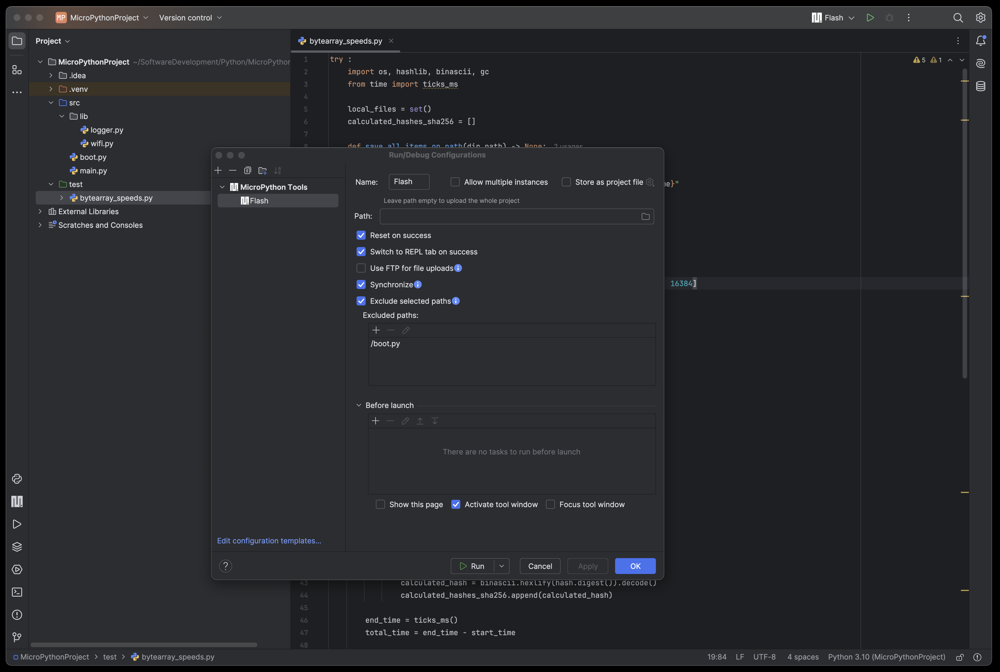
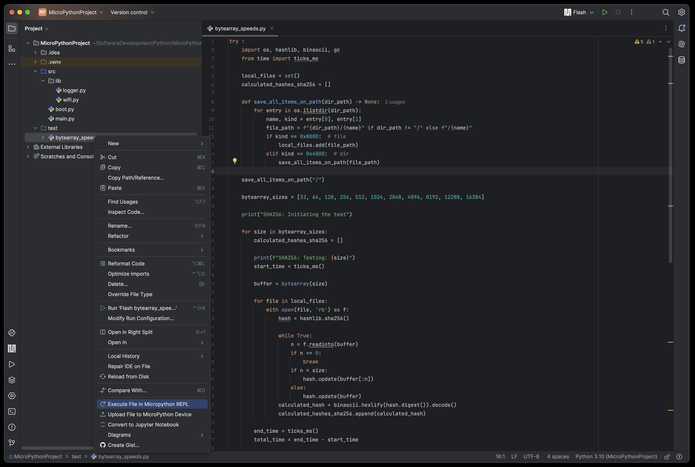

# MicroPython Tools for PyCharm

This is a fork of the [jetbrains intellij micropython plugin](https://github.com/JetBrains/intellij-micropython).
Credits to [Andrey Vlasovskikh](https://github.com/vlasovskikh) for creating the original plugin and
to [Ilia Motornyi](https://github.com/elmot) for rewriting the communication layer to kotlin and for developing the file system view, which serves as the foundation for this project.

Many thanks also go to all of the contributors who helped maintain and improve the plugin in the past and to [Jos Verlinde](https://github.com/Josverl/micropython-stubber) for developing and maintaining the MicroPython stubs that this plugin uses.

I have decided fork the original jetbrains plugin as its development had slowed and I wanted to focus on implementing
more advanced features that I deem invaluable based on my professional experience working with MicroPython

I believe that the MicroPython community needs robust, actively maintained and developed tools adding MicroPython
support to modern industry-standard IDEs. My aim with this fork is to address this need.

There will be frequent updates, I'm actively working on developing new features and fixing bugs in the existing
code. If you run into any problems while using this plugin, please create an issue. For any suggestions or feature
requests, feel free to start a discussion.

Some of the features you can expect soon include:

- Availability in CLion plugin marketplace
- Drag and drop file system interaction
- Integration with mpy-cross to allow compiling to bytecode

Long term plans:

- Built-in MicroPython firmware flashing support
- After the full-release of this plugin I might consider also developing MicroPython plugins for VSCode
  and possibly Visual Studio 2022

## Usage tips

To access all of the features this plugin offers always create a MicroPython Tools run configuration in a new project
and leave the path empty.

If no folder is marked as a sources root, the project root contents will be uploaded, if at least one folder is marked
as a source root, only source root contents will be uploaded. In all cases files/folders with a leading dot in their
name, excluded folders, and test
source roots are skipped. If you want to upload a test source root marked folder, or its contents, you can do so via
the context menu actions.

I also recommend enabling the synchronize option, this way you don't have to worry about cleaning up the File System
if you make large changes to your project. When flashing, all empty folders and files that were not apart of the
flashing operation will be deleted - you can also simply configure excluded target (MicroPython) paths, that will be
ignored by the synchronization feature.

For projects which involve flashing large files *(For MicoPython standards)*, FTP uploads might help speed things up,
especially if you're using serial communication.

## Features

### Expanded File System widget

- With new connection selector for easily switching between devices
  

### Expanded run configuration options

- Synchronization - automatically clean up the device file system when flashing
- Except device paths from synchronization (avoid deleting persistent data such as logs)
- FTP uploads for large projects - increased upload speed and reliability
- New tooltips
  

### Context sensitive menu actions

- Tooltip descriptions dynamically change based on your selection
- You can now select multiple items for the upload action
  

### Cleaned up settings menu

- Removed old unused device type dropdowns
- Updated the settings persistence system to use a more modern approach
- Added a Target Wi-Fi AP configuration for FTP upload functionality (The password is safely stored in
  the [Jetbrains password
  safe](https://plugins.jetbrains.com/docs/intellij/persisting-sensitive-data.html#storage))
  

### Other

- Automatically skips already uploaded files (on boards offering binascii library)
- Several bug fixes, new edge case handling, removed most of the old deprecated code, new python library management
  system and more backend changes

## Supported devices

Most MicroPython devices should be supported. However, this plugin wasn't tested with highly 
resource constrained microcontrollers such as the ESP8266 and with MicroPython versions below 1.20.

## Requirements

* A valid Python interpreter (3.10 is recommended for most accurate code analysis)
* Python plugin (IntelliJ only)
* A development board with MicroPython installed (If possible latest release, otherwise at least 1.20 is recommended)

The plugin is licensed under the terms of the Apache 2 license.
